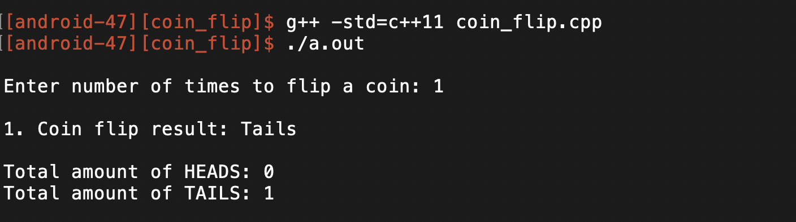

# Coin Flip

Author: Javier Garcia Ramirez (android-47)
Updated on: March 25, 2021

### FEATURES
* User can select x amount of times to flip a coin
* Coin flip result is random for each flip
* Displays the results of all x coin flips
* Displays the total number of times the coin landed on heads and tails at the end

## GAMEPLAY
### 16 Coin Flips

### 1 Coin Flip


### DESCRIPTION
This program allows the user to flip a coin x number of times. Each coin flip result displayed and is either heads or tails and is random. At the end of the program, the total number of times the coin landed on heads and tails is displayed.


### STEPS ON HOW TO COMPILE AND RUN THE PROGRAM
1. Compile the program using C++ 11 by entering the following into the terminal command line  

```
g++ -std=c++11 coin_flip.cpp
```

2. Run the program by running the executable file by entering the following line into the terminal command line:

```
./a.out
```

### KNOWN LIMITATIONS
* No error handling 